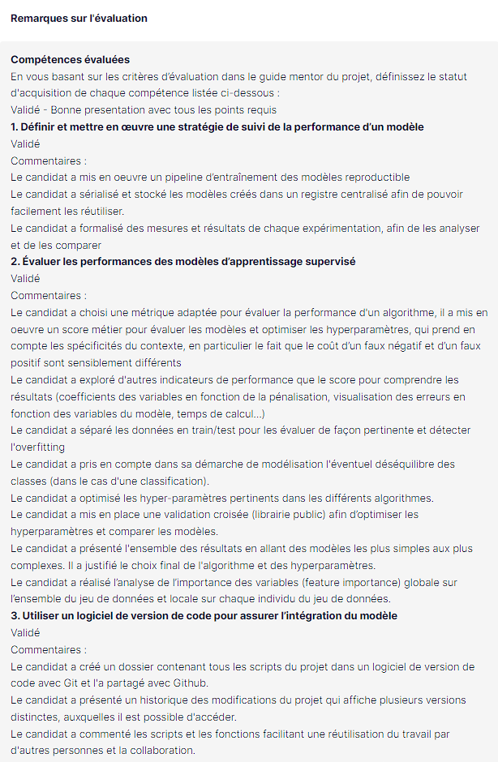
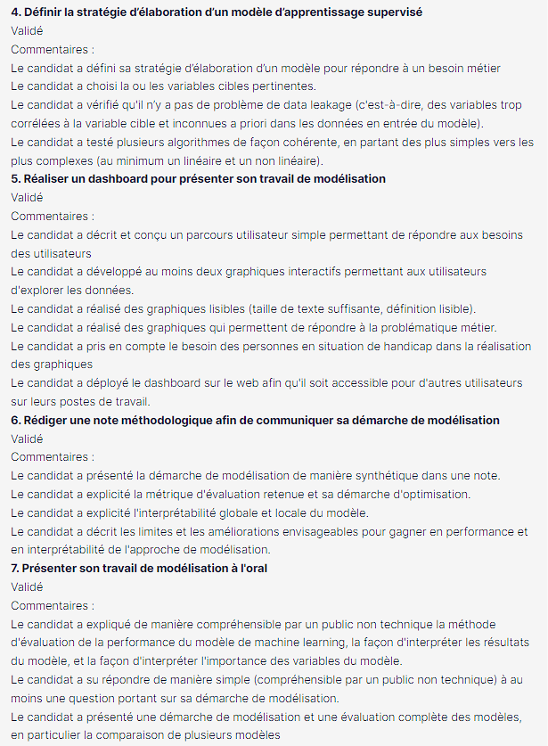
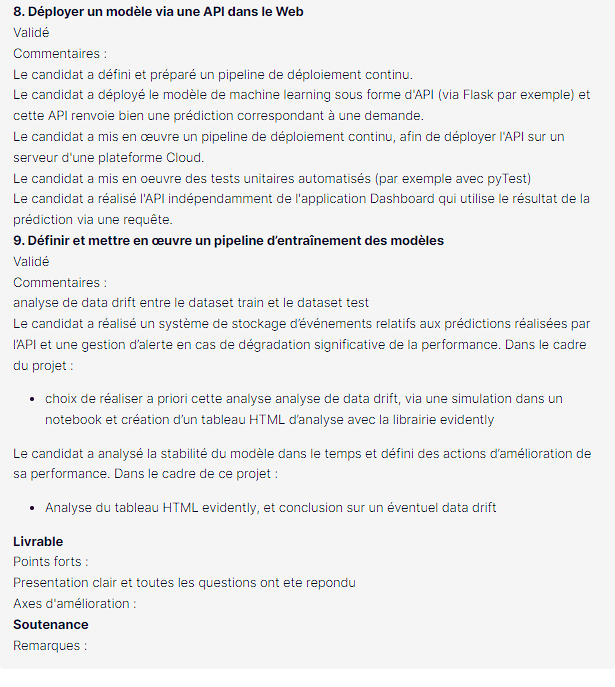

# Credit Scoring Dashboard and API
Welcome to the main repository of the Credit Scoring Project.
The project aims to predict the probability of credit default for potential clients, facilitate transparent decision-making, and provide insights for relationship managers.
This repository includes two key components: the Credit Scoring Dashboard and the Credit Scoring API.

## Table of Contents

- [Features](#features)
- [Getting Started](#getting-started)
  - [Prerequisites](#Prerequisites)
  - [Usage](#usage)
    - [Dashboard](#dashboard)
    - [API](#api)
- [File Structure](#file-structure)
- [Skills and assessment ](#skills-and-assessment )

## Features

- **Dashboard**: Interactive web application built with Streamlit, providing relationship managers with the ability to evaluate a client's credit score, view client information, and explore model predictions visually.
- **API**: Flask-based API for retrieving credit scoring predictions programmatically.
- **Data Drift Detection**: Utilizes Evidently library to detect data drift between training and production datasets.
- **Custom Scoring Metric**: Implements a custom scoring metric, F10Score, to account for business-specific constraints.
- **Model Optimization**: Uses Optuna for hyperparameter optimization and handles class imbalance using class weights and probability threshold tuning.

## Getting Started

### Prerequisites

- Python 3.7 or higher
- Data available here : https://www.kaggle.com/c/home-credit-default-risk/data

### Usage

#### Dashboard

##### Installation

1. Clone the repository:

   ```bash
   git clone https://github.com/YassineR/P7.git
   ```

2. Change directory to the project folder:

   ```bash
   cd P7
   ```

3. Install dependencies:

   ```bash
   pip install -r requirements.txt
   ```
To run the interactive dashboard, execute the following command:

##### Run
```bash
streamlit run dashboard.py
```

Access the dashboard at `http://localhost:8501` in your web browser.

#### API
##### Installation

1. Clone the repository:

   ```bash
   git clone https://github.com/YassineR/P7-backend.git
   ```

2. Change directory to the project folder:

   ```bash
   cd P7-backend
   ```

3. Install dependencies:

   ```bash
   pip install -r requirements.txt
   ```
To run the interactive dashboard, execute the following command:

##### Run
To start the Flask API, run:

```bash
python app.py
```

The API will be accessible at `http://localhost:5000`. Refer to the API documentation for endpoint details.

## File Structure

- **Modelisation**: Folder containing Jupyter notebooks with the data processing.
    - `Pretraitement et premiere modélisation.ipynb`: Notebook detailing the pre processing and the modelisation.
    - `Optimisation modéle.ipynb`: Notebook detailing the model optimisation using Optuna, cross validation and lgbm threshold.
  
- **Data Drift**: Folder containing the data drift analysis.
    - `Data drift.ipynb` : Notebook detailing the data drift analysis using Evidently.
    - `*_data_drift.html` : HTML files describing the Data Drift by data file.

- **Explanations**: Files describing the key stages of the project.
    - `Note methodologique`: Methodological documentation to describe the modelisation and optimisation process.
    - `Introduction Dashboard API.ipynb`: Introductory file explaining the project's objectives, folder structure, and a list of used packages for both the dashboard and API applications.
    - `Presentation.pdf`: Slides providing an overview of my project, including the data analysis process and key findings presented during the defense.
      
- **P7 repo**
  - **dashboard.py**: Streamlit application for the interactive dashboard.
  - **home_credit_data_sample.csv**: Sample preprocessed data for demonstration.
  - **logo.png**: Project logo used in the dashboard.
  - **model.pkl**: Serialized LightGBM model for credit scoring.
  - **requirements.txt**: List of Python dependencies.
  - **tools.py**: Utility functions for generating visualizations.
- **P7-backend repo**
  - **app.py**: Flask-based API for credit scoring predictions.
  - **lgbm_client_scoring.pkl**: Serialized LightGBM model for the API.
  - **requirements.txt**: List of Python dependencies for the API.
  - **tests/**
    - **test_app.py**: Unit tests for API endpoints.


## Skills and assessment 



